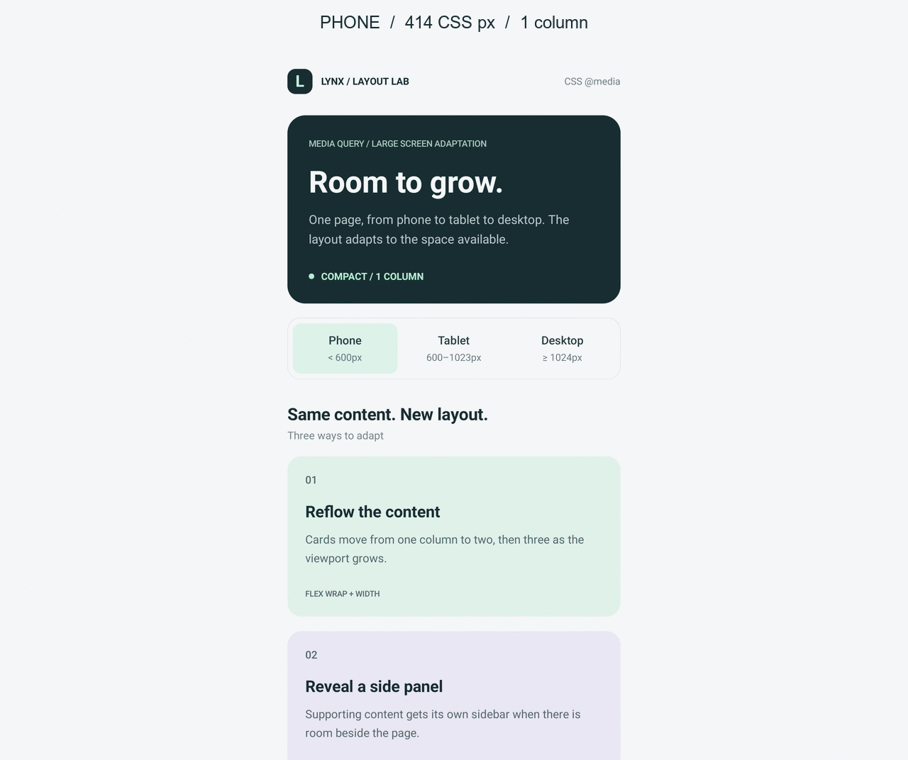

# Media Query

A responsive ReactLynx page for adapting to large screens with CSS `@media`.
The same content reflows from a phone layout into a tablet or desktop layout.
There is no JavaScript viewport detection or device-specific component tree.



The preview cycles through three device screenshots. Each viewport was loaded
separately; this is a comparison of layouts, not a recording of live resizing.

## Run

From the repository root:

```sh
pnpm --filter @lynx-example/media-query run dev
```

Open the QR code in Lynx Explorer, or open the Web preview and resize its window.
To build both targets:

```sh
pnpm --filter @lynx-example/media-query run build
```

The native bundle is `dist/main.lynx.bundle`; the Web entry is `dist/main.web.bundle`.

## Responsive behavior

Breakpoints use the **Lynx viewport width in CSS pixels**, not physical screen
pixels or the width of an individual card. The highlighted breakpoint and hero
label are also controlled by media queries.

| Viewport width        | Content                       | Side panel | Page padding | Heading |
| --------------------- | ----------------------------- | ---------- | ------------ | ------- |
| Below 600px           | One column                    | Hidden     | 20px         | 34px    |
| 600px to below 1024px | Two columns, third card wraps | Hidden     | 32px         | 44px    |
| 1024px and above      | Three columns                 | Visible    | 40px         | 52px    |

At widths of at least 1024px and heights of at most 700px, an `and` query reduces
vertical padding. The page scrolls vertically in every layout. Content is centered
and capped at 1440px on extra-wide viewports.

[`src/App.css`](./src/App.css) demonstrates mobile-first `min-width` rules,
Level 4 range syntax for mutually exclusive indicators, and a combined width/height
condition. Resize across 599/600px and 1023/1024px to inspect the boundaries.

## Lynx requirements

Use **Lynx SDK 4.0 or later**. [`rsbuild.config.ts`](./rsbuild.config.ts) registers
`pluginLynxConfig({ enableCSSRule: true })`; without CSS Rule encoding, media queries
will not take effect in the native bundle. When embedding the page, the host must
update the Lynx viewport when the window size changes.

When testing with Android display-size overrides, reload the page after each
change. Some hosts, including the Lynx Explorer used in Sandbox, resize the view
without refreshing the media-query environment until reload.

The app uses text and CSS only, so there are no runtime assets to relocate.
`preview.gif` is a documentation asset included in the package, not inlined into
or loaded by the app bundle.

See the [Lynx Media Query reference](https://lynxjs.org/api/css/media-query).
